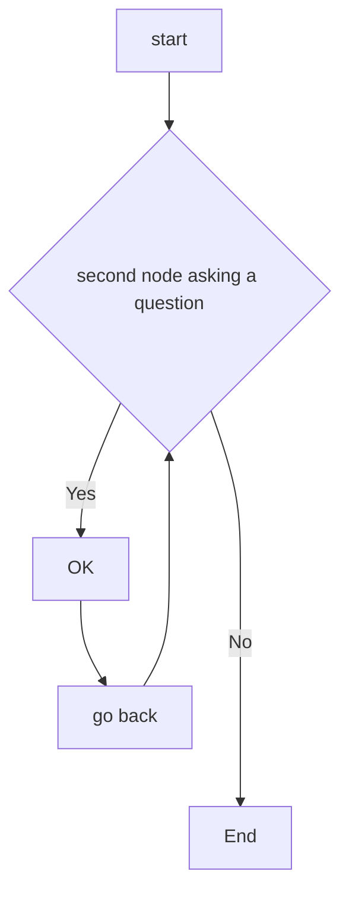

# MATLAB_REGRESSION_LEARNER

This repository shows how to create and compare various regression neural network models using the Matlab Regression Learner app.
The aim is to export trained models on  custom data-sets derived from [Neural Designer Platform](https://www.neuraldesigner.com/) to make predictions for new data. 

********
********

# Body Fat Estimation

This [Matlab Neural Network example](https://nl.mathworks.com/help/deeplearning/ug/body-fat-estimation.html) illustrates how a function fitting neural network can estimate body fat percentage based on anatomical measurements.
We start by copying the following  Command in Matlab Command Window ====>

```
openExample('nnet/BodyFatEstimationExample')
```


********
********

# CHARTS + CODING




```
function test() {
  console.log("notice the blank line before this function?");
}
```
