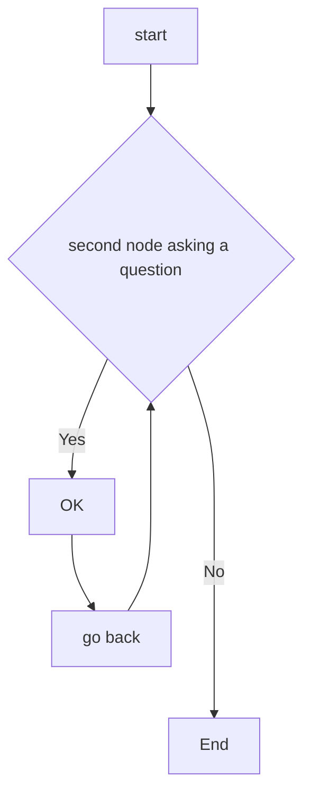

# MATLAB_REGRESSION_LEARNER

This repository shows how to create and compare various regression neural network models using the Matlab Regression Learner app.
The aim is to export trained models on  custom data-sets derived from [Neural Designer Platform](https://www.neuraldesigner.com/) to make predictions for new data. 


********
********

# Body Fat Estimation

We first review the [Matlab Neural Network example](https://nl.mathworks.com/help/deeplearning/ug/body-fat-estimation.html) describing how a function fitting neural network can estimate body fat percentage based on anatomical measurements.
We start by copying the Command ---shown below--- in Matlab Command Window ====>

```
openExample('nnet/BodyFatEstimationExample')
```
<p align="center">

</p>

```
% Solve an Input-Output Fitting problem with a Neural Network
% Script generated by Neural Fitting app
% Created 15-Mar-2021 10:48:13
%
% This script assumes these variables are defined:
%
%   bodyfatInputs - input data.
%   bodyfatTargets - target data.

x = bodyfatInputs;
t = bodyfatTargets;

% Choose a Training Function
% For a list of all training functions type: help nntrain
% 'trainlm' is usually fastest.
% 'trainbr' takes longer but may be better for challenging problems.
% 'trainscg' uses less memory. Suitable in low memory situations.
trainFcn = 'trainlm';  % Levenberg-Marquardt backpropagation.

% Create a Fitting Network
hiddenLayerSize = 10;
net = fitnet(hiddenLayerSize,trainFcn);

% Setup Division of Data for Training, Validation, Testing
net.divideParam.trainRatio = 70/100;
net.divideParam.valRatio = 15/100;
net.divideParam.testRatio = 15/100;

% Train the Network
[net,tr] = train(net,x,t);

% Test the Network
y = net(x);
e = gsubtract(t,y);
performance = perform(net,t,y)

% View the Network
view(net)

% Plots
% Uncomment these lines to enable various plots.
%figure, plotperform(tr)
%figure, plottrainstate(tr)
%figure, ploterrhist(e)
%figure, plotregression(t,y)
%figure, plotfit(net,x,t)
```

********
********

# RESOURCES

* [AIRA Workshops Miro-Board](https://miro.com/app/board/uXjVOZhJLBM=/?share_link_id=629710348043)

* [MathWorks-Teaching-Resources | Machine-Learning-for-Regression](https://github.com/MathWorks-Teaching-Resources/Machine-Learning-for-Regression)

* [Matlab Statistics: Regression](https://nl.mathworks.com/help/stats/regression-and-anova.html?s_tid=CRUX_lftnav)

* [Is Regression Machine learning](https://stats.stackexchange.com/questions/268755/when-should-linear-regression-be-called-machine-learning)

* [Shallow Neural Networks with Parallel and GPU Computing](https://nl.mathworks.com/help/deeplearning/ug/neural-networks-with-parallel-and-gpu-computing.html)

********
********

# CHARTS + CODING




```
function test() {
  console.log("notice the blank line before this function?");
}
```
