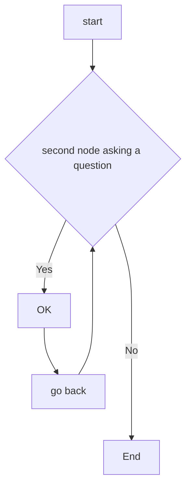

# MATLAB_REGRESSION_LEARNER

This repository shows how to create and compare various regression neural network models using the Matlab Regression Learner app.
The aim is to export trained models on  custom data-sets derived from [Neural Designer Platform](https://www.neuraldesigner.com/) to make predictions for new data. 


<p align="center">

</p>


[A Simple Example of Pipeline in ML ](https://medium.com/@mannem16/a-simple-example-of-pipeline-in-ml-and-why-do-you-need-to-learn-it-6736795df72a)


********
********

# Body Fat Estimation

We first review the [Matlab Neural Network example](https://nl.mathworks.com/help/deeplearning/ug/body-fat-estimation.html) describing how a function fitting neural network can estimate body fat percentage based on anatomical measurements.
We start by copying the Command ---shown below--- in Matlab Command Window ====>

```
openExample('nnet/BodyFatEstimationExample')
```
<p align="center">

</p>

```
% Solve an Input-Output Fitting problem with a Neural Network
% Script generated by Neural Fitting app
% Created 15-Mar-2021 10:48:13
%
% This script assumes these variables are defined:
%
%   bodyfatInputs - input data.
%   bodyfatTargets - target data.

x = bodyfatInputs;
t = bodyfatTargets;

% Choose a Training Function
% For a list of all training functions type: help nntrain
% 'trainlm' is usually fastest.
% 'trainbr' takes longer but may be better for challenging problems.
% 'trainscg' uses less memory. Suitable in low memory situations.
trainFcn = 'trainlm';  % Levenberg-Marquardt backpropagation.

% Create a Fitting Network
hiddenLayerSize = 10;
net = fitnet(hiddenLayerSize,trainFcn);

% Setup Division of Data for Training, Validation, Testing
net.divideParam.trainRatio = 70/100;
net.divideParam.valRatio = 15/100;
net.divideParam.testRatio = 15/100;

% Train the Network
[net,tr] = train(net,x,t);

% Test the Network
y = net(x);
e = gsubtract(t,y);
performance = perform(net,t,y)

% View the Network
view(net)

% Plots
% Uncomment these lines to enable various plots.
%figure, plotperform(tr)
%figure, plottrainstate(tr)
%figure, ploterrhist(e)
%figure, plotregression(t,y)
%figure, plotfit(net,x,t)
```

********
********

# CSV DATA-SETS


********
********


# NeuralDesigner: EXPLAINABLE AI PLATFORM

```
%%%% https://www.neuraldesigner.com/
%%%% EXAMPLE https://www.neuraldesigner.com/learning/examples/telecommunications-churn#DataSet
clear all

%%%% folder path 
dirName = 'C:\Users\rob\OneDrive - Hogeschool Rotterdam\WORKSHOPS\AI_TOEPASSER\RECOURCES\NEURAL_DESIGNER\DATA_SET';

%%dirName = 'C:\Users\PROMET01\OneDrive - Hogeschool Rotterdam\WORKSHOPS\AI_TOEPASSER\RECOURCES\NEURAL_DESIGNER\DATA_SET';

%dirName = 'C:\Users\PROMET01\OneDrive - Hogeschool Rotterdam\WORKSHOPS\AI_TOEPASSER\RECOURCES\NEURAL_DESIGNER\DATA_SET';
cd(dirName) %make it the current directory

files = dir(fullfile(dirName,'*.csv') );   %# list all *.xyz files
files = {files.name}';                      %'# file names 


numfiles = files;
for k=1:length(numfiles)
  numfiles{k}=[num2str(k), ' ',numfiles{k}];
end

disp(numfiles)
clear k,numfiles


data = readtable(char(files(5)))
% [data tb] = rmoutliers(cdata);
% data
varnames=data.Properties.VariableNames


%%% CREATE TEST DATA

testdata=data(100,1:end)
%%%%%yfit = trainedModelrob.predictFcn(testdata)

%%% CREATE histogram from NOx variable

histogram(data.(2))

x=1:width(data)-1;
y=data{1:end,2};

% z=data{1:end,2};
% [y,tb] = rmoutliers(z);  %remove outliers


ncount=hist(y)
relativefreq = ncount/length(y);
numIntervals =  12;
intervalWidth = (max(y) - min(y))/numIntervals;
bar(relativefreq,1)
xlim([min(x) max(x)])
set(gca, 'xtick', x)
text(x,relativefreq,num2str((relativefreq*100)','%0.2f'),'vert','bottom','horiz','center'); 
box off

format short
[r, p]= corrcoef(data.(1),data.(width(data)))

measurement_vars =  data{1:end,1:width(data)-2}
target_var = data.(width(data))
cdata = corr(measurement_vars,target_var,'rows','complete')
labels = categorical( regexprep(varnames(1:end-2), '_', ' ') )


%[a b ] = sort(labels,'ascend')
[a b] = sort(abs(cdata))
barh(cdata(b))
set(gca, 'YTickLabel', labels(b))
xx=1:6;
yy=cdata(b);
text(yy,xx,num2str((yy),'%0.2f'),'horiz','center','vert','bottom')
box off

Here are the steps for exporting a model to the MATLAB® workspace:
In the app, select the model you want to export in the Models pane.
On the Regression Learner tab, in the Export section, click one of the export options:
To include the data used for training the model, click Export Model and select Export Model. This option exports the trained model to the workspace as a structure containing a regression object, such as RegressionTree. The model object includes the training data when possible. Note that some models, such as kernel approximation models, never store training data.

To exclude the training data, click Export Model and select Export Compact Model. This option exports the model with unnecessary data removed. That is, the exported structure contains a regression object that, when possible, does not include the training data. You can still use the model for making predictions on new data.
In the Export Model dialog box, check the name of your exported variable, and edit it if you want. Then, click OK. The default name for your exported model, trainedModel, increments every time you export to avoid overwriting your models (for example, trainedModel1).
The new variable (for example, trainedModel) appears in your workspace.
The app displays information about the exported model in the command window. Read the message to learn how to make predictions with new data.

%%%% HOW TO USE MODEL TO PREDICT
% On the Regression Learner tab, in the Export section, click one of the export option
% ====> Export Compact Mode

% read in test Data as a Cell labels + values
 testdata=data(100,1:end-1);

 %%%  predicted vs actual
 yfit = trainedModelZ.predictFcn(testdata)  % predict
 data{100,end:end}                            % actual


```


********
********


# RESOURCES

* [AIRA Workshops Miro-Board](https://miro.com/app/board/uXjVOZhJLBM=/?share_link_id=629710348043)

* [MathWorks-Teaching-Resources | Machine-Learning-for-Regression](https://github.com/MathWorks-Teaching-Resources/Machine-Learning-for-Regression)

* [Matlab Statistics: Regression](https://nl.mathworks.com/help/stats/regression-and-anova.html?s_tid=CRUX_lftnav)

* [Is Regression Machine learning](https://stats.stackexchange.com/questions/268755/when-should-linear-regression-be-called-machine-learning)

* [Shallow Neural Networks with Parallel and GPU Computing](https://nl.mathworks.com/help/deeplearning/ug/neural-networks-with-parallel-and-gpu-computing.html)

* [Data Sets for Deep Learning](https://nl.mathworks.com/help/deeplearning/ug/data-sets-for-deep-learning.html#responsive_offcanvas)

* ===> OneDrive <=== \WORKSHOPS\AI_TOEPASSER\RECOURCES\NEURAL_DESIGNER\DATA_SET

********
********

# CHARTS + CODING




```
function test() {
  console.log("notice the blank line before this function?");
}
```
