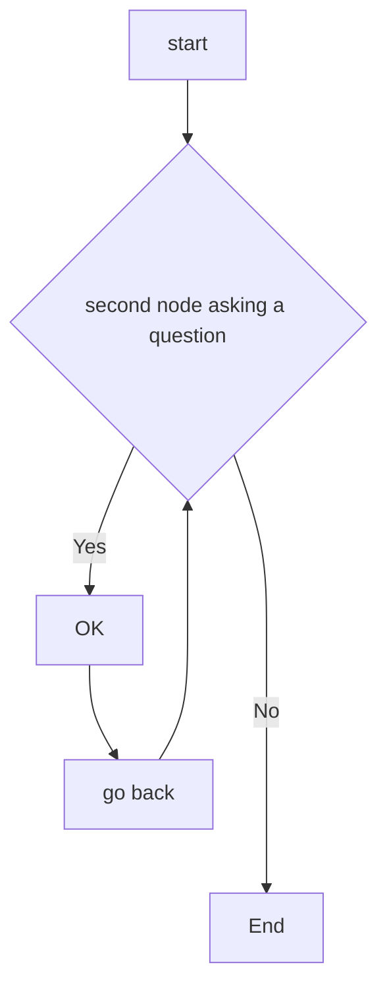

# MATLAB_REGRESSION_LEARNER


This repository shows how to create and compare various regression neural network models using the Matlab Regression Learner app.
The aim is to export trained models on  custom data-sets derived from [Neural Designer Platform](https://www.neuraldesigner.com/) to make predictions for new data. 

********
********

# Body Fat Estimation

This example illustrates how a function fitting neural network can estimate body fat percentage based on anatomical measurements.


```
Copy Command in Matlab Command Window ====>

  ## openExample('nnet/BodyFatEstimationExample')

```


********
********

# CHARTS + CODING




```
function test() {
  console.log("notice the blank line before this function?");
}
```
