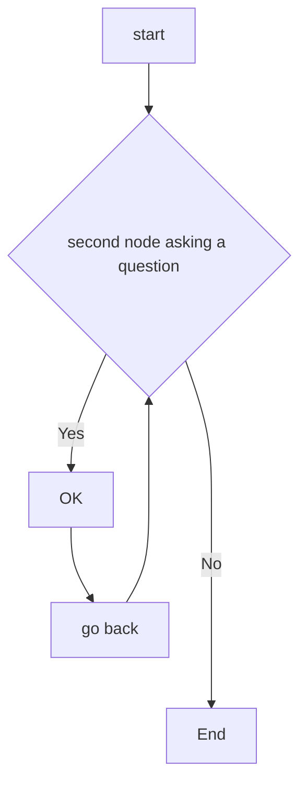

# MATLAB_REGRESSION_LEARNER

This repository shows how to create and compare various regression neural network models using the Matlab Regression Learner app.
The aim is to export trained models on  custom data-sets derived from [Neural Designer Platform](https://www.neuraldesigner.com/) to make predictions for new data. 

********
********

# Body Fat Estimation

We first review the [Matlab Neural Network example](https://nl.mathworks.com/help/deeplearning/ug/body-fat-estimation.html) describing how a function fitting neural network can estimate body fat percentage based on anatomical measurements.
We start by copying the Command ---shown below--- in Matlab Command Window ====>

```
openExample('nnet/BodyFatEstimationExample')
```
<p align="center">

</p>

********
********

# RESOURCES

* [AIRA Workshops Miro-Board](https://miro.com/app/board/uXjVOZhJLBM=/?share_link_id=629710348043)

* [MathWorks-Teaching-Resources | Machine-Learning-for-Regression](https://github.com/MathWorks-Teaching-Resources/Machine-Learning-for-Regression)

*

********
********

# CHARTS + CODING




```
function test() {
  console.log("notice the blank line before this function?");
}
```
